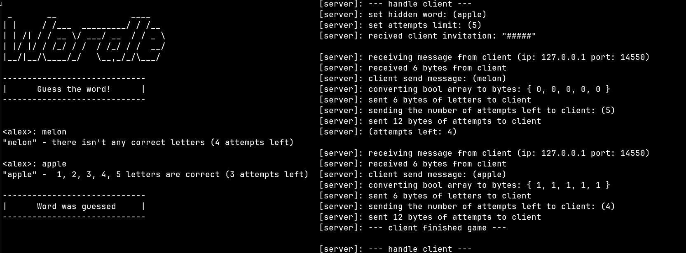
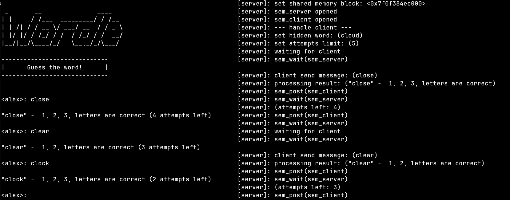

# wordle
Copy of web-based word guessing game written in C/C++

Two versions of interconnection:
- UDP (User Datagram Protocol) version
- IPC (Inter Process Communication) version

## UDP version


## IPC version


## Installation
First clone this repository:
```console
git clone https://github.com/alkuzin/wordle.git
```
Before building the project you need to select interconnection mode *(default: IPC)*

For UDP version:
```cpp
make udp
```

For IPC version:
```cpp
make ipc
```

Then build UDP & IPC versions run:
```console
make all
```

And run those commands in separate terminals:
For UDP version:
```console
clear && ./server_udp
```
```console
clear && ./client_udp
```

For IPC version:
```console
clear && ./server_ipc
```
```console
clear && ./client_ipc
```

In order to return to original state run:
```console
make fclean
```
